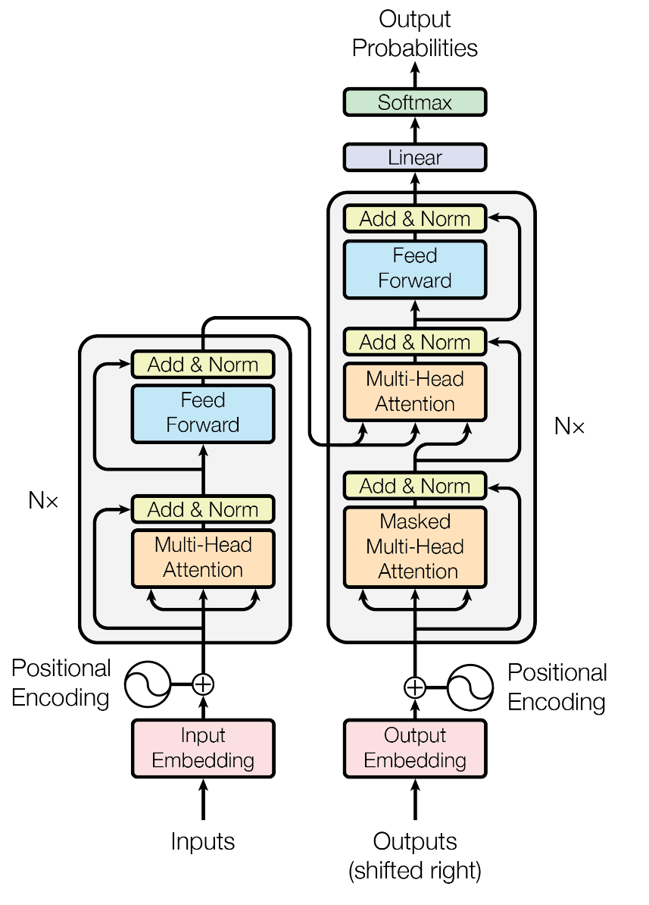

# Transformers for NLP: Traduzione italiano - inglese
Il progetto realizza ed implementa un Transformer, rete neurale particolarmente utilizzata per diverse finalità nel mondo dell'NLP (Natural Language Processing).
Il Transformer è stato poi impiegato come traduttore: ossia come modello di Machine Learning capace, ricevuta una frase in input in italiano dall'utente, di produrre la corrispondente traduzione in inglese come output finale.

La soluzione presentata è stata sviluppata facendo riferimento a molteplici fonti e spunti di studio: 
1) **Attention Is All You Need**: https://arxiv.org/pdf/1706.03762.pdf (paper ufficiale)
2) **Transformers**: https://towardsdatascience.com/transformers-89034557de14
3) **How do Transformers Work in NLP?**:
   https://www.analyticsvidhya.com/blog/2019/06/understanding-transformers-nlp-state-of-the-art-models/
4) **The Illustrated Transformer**: https://jalammar.github.io/illustrated-transformer/

In aggiunta, è stato consultato parzialmente il libro:  
**Transformers for Natural Language Processing: Build, train, and fine-tune deep neural network architectures for NLP with Python, PyTorch, TensorFlow, BERT, and GPT-3, 2nd Edition**  
acquistabile al link seguente:  
https://www.amazon.it/Transformers-Natural-Language-Processing-architectures/dp/1803247339/ref=sr_1_1?__mk_it_IT=%C3%85M%C3%85%C5%BD%C3%95%C3%91&crid=ZURAY393RQP2&keywords=transformers+python&qid=1650619189&sprefix=transformers+python%2Caps%2C87&sr=8-1

# Dataset
Per questo progetto è stato usato il dataset relativo alla sessione parlamentare europea:"European Parliament Proceedings Parallel Corpus 1996-2011".
Il dataset è disponibile a questo link: https://www.statmt.org/europarl/
**Attenzione**: Selezionare il dataset relativo a Italiano - Inglese.
All'interno del dataset si trovano due file testuali (italian.txt e english.txt) che contengono a riga uguale la stessa frase tradotta nella lingua corrispondente.

# Transformers: Struttura e Modello
Il Transformer è composto da due parti/componenti fondamentali: l'**Encoder** e il **Decoder**, collegati sequenzialmente come mostrato in figura:

A completare l'intera organizzazione sono presenti un **Input Embedding** combinato con un **Positional Embedding** che formatta i dati ricevuti in input opportunamente per le elaborazioni che verranno svolte dall'Encoder e un **Output Embedding** che, congiuntamente ad un **Positional Embedding**, pre- elabora i dati risultanti dall'Encoder per renderli utilizzabili dal Decoder. 
Infine, al termine delle elaborazioni, vengono realizzate alcune attività di "post processing" che consistono in una **Softmax** e in una **Linear**.
Per una spiegazione più dettagliata e precisa, si invita a consultare la relazione pdf allegata al progetto.

# Organizzazione del Progetto

Il progetto è strutturato in moduli, ciascuno dei quali comprende funzionalità e componenti tra loro dipendenti e strettamente legati.
Nello specifico, abbiamo individuato 5 moduli distinti:
1) **vocabolario.py**: realizza l'oggetto Vocabolario per entrambe le lingue prese in considerazione. Memorizza ogni singola parola e si occupa di memorizzare il numero di volte che compare nel file testuale letto. Si occupa inoltre della tokenizzazione.
2) **componenti.py**: contiene tutte le componenti che vengono richieste nella struttura del Transformer: dall'Encoder al Decoder fino alle loro rispettive componenti più dettagliate come MultiHeadAttention, EncoderLayer e DecoderLayer. Infine contiene la componente Transformer che crea l'oggetto Transformer come unione di tutte le precedenti parti.
3) **traduci.py**: modulo invocato quando si vuole eseguire una traduzione di una frase: ricevuti i parametri di input necessari, si occupa di inizializzare le strutture dati del Transformer e di collegarle tra loro. Infine si occupa, terminata la traduzione di mostrare in output i risultati ottenuti.
4) **training.py**: esegue l'intera attività di training dei dati, elabora i dataset e da essi ne estrae strutture dati finali da cui eseguire poi la traduzione quando richiesto.
5) **funzioni.py**: modulo che contiene alcune funzioni esterne di utilità varia e generale, che però non rientrano in nessuno degli altri moduli precedentemente esposti.

# Componenti e moduli python utilizzati:

Nel corso dello sviluppo delle varie componenti si è fatto uso di alcune librerie esterne, in grado di fornire supporti e funzionalità essenziali per la progettazione del Transformer:

1) matplotlib
2) numpy
3) pytorch

# Alcuni risultati ottenuti: 

**italiano**: "Io sono uno studente"  
**inglese**: "I am a student"  

**italiano**: "Roma è la capitale dell'Italia"  
**inglese**: "Rome is the capital of Italy"

**italiano**: "Io non devo fare errori"  
**inglese**: "I cannot go wrong"  

**italiano**: "Io sono molto ricco."  
**inglese**: "I am very much rich."